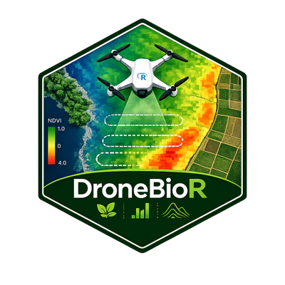

# DroneBioR 

<!-- badges: start -->
[](https://github.com/HugoMachadoRodrigues/DroneBioR/actions/workflows/R-CMD-check.yaml)
[](https://github.com/HugoMachadoRodrigues/DroneBioR/actions/workflows/pkgdown.yaml)
[](https://www.gnu.org/licenses/agpl-3.0)
[](https://lifecycle.r-lib.org/articles/stages.html#experimental)
[](https://cran.r-project.org/)
<!-- badges: end -->

**DroneBioR** is a research-oriented R package and Shiny app (Drone Biomass
Studio) for drone biomass analysis with MicaSense multispectral imagery.
It delegates the heavy photogrammetry work (SfM, MVS, mesh, texturing) to
external engines — **OpenDroneMap**, **WebODM**, **Pix4Dmapper** or
**Agisoft Metashape** — and contributes the scientific layer in R:

```text
Engine outputs (orthomosaic, DSM, DTM, dense point cloud, textured mesh)
  -> alpha / no-data masking
  -> radiometric scaling to reflectance
  -> 9 vegetation indices (NDVI, NDRE, EVI, SAVI, NDWI, GNDVI,
                           CIrededge, MSAVI2, VARI)
  -> ground / vegetation classification
  -> canopy height model + ROI metrics
  -> survey-grade volume math (DTM / min-Z / mean-Z / quantile /
                               user-plane / Pix4D-style perimeter TIN)
  -> field sample extraction + baseline biomass model
  -> time-series tracking across flights
  -> HTML report (RMarkdown template)
  -> Drone Biomass Studio: 7-panel Shiny app for interactive
     GIS + 3D modeling + spectral + survey + reporting
```

### What's in the Shiny app

* **GIS Workspace** — basemap + index overlays with COG-style tiling
  (smooth pan/zoom on big orthomosaics), distance / area / CHM-volume
  measurement tools, named ROI comparison table, GeoJSON annotation
  pinning, hillshade-from-DSM overlay.
* **Processing Engine** — drives OpenDroneMap via Docker.
* **3D Modeling** — full-width WebGL viewport with OrbitControls, XYZ
  orientation gizmo, live scale bar, and an opt-in textured-OBJ mesh
  loader (loads ODM's `odm_textured_model_geo.obj` straight into
  three.js). Survey-grade volume calculations over the convex hull of
  the currently-selected points, with six base-reference methods
  (Pix4D / ContextCapture / Trimble convention).
* **Spectral Analytics** — orthomosaic reading, radiometric scaling,
  panel calibration, the 9-index stack, application maps.
* **Field Models** — extract spectral values at field samples, fit
  a baseline biomass linear model.
* **Time Series** — register multiple flights of the same site and
  plot NDVI / biomass / CHM across dates.
* **Exports** — `run_dronebio_workflow()` one-click; HTML report
  via `render_dronebio_report()`.

## Installation

DroneBioR is research software distributed through GitHub.

```r
# install.packages("remotes")
remotes::install_github("HugoMachadoRodrigues/DroneBioR")
```

System requirements: **GDAL ≥ 3.0**, **PROJ ≥ 6.0**, **GEOS ≥ 3.8** (installed
automatically with `terra` and `sf` on most platforms). Docker is optional —
only needed if you want DroneBioR to drive OpenDroneMap directly.

## Quick start

Bring an orthomosaic from any of the four supported engines and run the
end-to-end scientific workflow:

```r
library(DroneBioR)

project <- dronebio_project(project_dir = "/path/to/Drone_Biomass")

result <- run_dronebio_workflow(
  project     = project,
  use_alpha   = TRUE
)

names(result)
#> [1] "project" "orthomosaic" "bands" "reflectance" "indices"
#> [6] "biomass_proxy" "alpha" "reflectance_summary" "index_summary"
#> [10] "output_paths"
```

For a baseline biomass model from field samples:

```r
field   <- read_field_data("data/field_samples.csv")
joined  <- extract_field_spectral_data(field, result$indices)
model   <- fit_biomass_lm(joined)
summary(model)
```

Try it without any data of your own — every exported function has a runnable
`@examples` block that uses the bundled fixtures in `inst/extdata/`:

```r
?compute_spectral_indices
example(compute_spectral_indices)
```

## Interactive exploration

```r
run_drone_biomass_studio(project_dir = "/path/to/Drone_Biomass")
```

Drone Biomass Studio is a Shiny app for previewing orthomosaics, indices,
the CHM, and point-cloud ROIs interactively.

## Documentation

Four vignettes cover the workflow in depth:

- [Overview](vignettes/dronebior-overview.Rmd) — end-to-end pipeline.
- [External engines](vignettes/external-engines.Rmd) — read products
  from ODM, WebODM, Pix4Dmapper and Agisoft Metashape.
- [Spectral indices](vignettes/spectral-indices.Rmd) — index catalogue
  and recommended use per crop and canopy density.
- [Point clouds and CHM](vignettes/point-clouds-and-chm.Rmd) — dense
  point cloud analyses and CHM ROI metrics.

A browsable site is published at
<https://hugomachadorodrigues.github.io/DroneBioR/>.

## Scope

DroneBioR is a **wrapper plus scientific layer**: it does not implement
Structure-from-Motion, Multi-View Stereo, mesh generation or texturing.
Those algorithms live in the external engine of your choice. This keeps the
R package focused on the scientific workflow and preserves a clean technical
and legal boundary with the engine.

## Contributing

Bug reports, feature requests, new indices, new engine readers, vignettes,
examples, tests and code reviews are all welcome. Please read
[CONTRIBUTING.md](CONTRIBUTING.md) and the
[Code of Conduct](CODE_OF_CONDUCT.md) before opening a pull request.

## Citation

If your work uses DroneBioR, please cite it. Run `citation("DroneBioR")` in R
or refer to [`CITATION.cff`](CITATION.cff).

## License

DroneBioR is released under the [GNU Affero General Public License v3](LICENSE.md).
